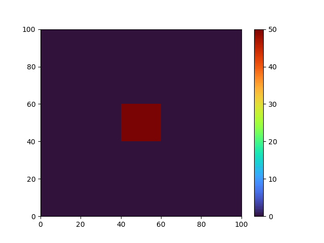

# Heat Equation in 2D

This example considers,
```math
\begin{align*}
\frac{\partial u}{\partial t} &= \alpha \Delta u  & \text{in} & \ \Omega = (0,10) \times (0,10) \ \text{for} \ t > 0\\
u &= 0                                            & \text{on} & \ \partial \Omega \ \text{for} \ t > 0\\
u &= f(x,y)                                       & \text{in} & \ \Omega \ \text{at} \ t = 0,
\end{align*}
```
where $`f`$ is given by
```math
f(x,y) =
\begin{cases}
50 &\text{if } 4 \le x \le 6, 4 \le y \le 6,\\
0 &\text{else.}
\end{cases}
```

**Running** The binaries take the mesh extents as positional
paramters. Whether to output the solution at every step and $`\alpha`$
are additional optional parameters.

For example, to run with implicit time integration using $`\alpha = 1.5`$ and outputting the solution at each step:
```bash
$ mpirun -np 4 ./heat-implicit 100 100 -d 1.5 -o true
```
Similarly, to run with explicit time integration:
```bash
$ mpirun -np 4 ./heat-explicit 100 100 -d 1.5 -o true
```

The utilities in [utility directory](./util) can be used to visualize the solutions.


**Mesh** The mesh is a simple 2D specialization of the `narray`
topology [mesh](./mesh.hh).  In addition to defining the mesh,
variables are declared for the mesh and coloring slots, as well as
field definitions that will be used to store $`u^k`$ and $`u^{k+1}`$.

    inline mesh::slot m;
    inline mesh::cslot coloring;

    inline std::array<field<double>::definition<mesh, mesh::vertices>, 2> ud;

**Control Policy** The control policy for this example can be found in
[control policy](./control.hh). `initialize`,`advance`, and `finalize`
control points are declared and state is added to store the
`flecsolve::vec::mesh` instances.  These provide a vector interface to
the fields stored on mesh and will be backed by the field definitions
declared previously.  A helper function is added that will be used to
intialize these once the mesh has been allocated:

    void initialize_vectors() {
	    u_.emplace(m, ud[0](m));
	    unew_.emplace(m, ud[1](m));
    }

**Operator** The operator used to apply $`\alpha \Delta`$ to a vector is defined in [heat.hh](./heat.hh):

    struct heat_op {
        heat_op(double d) : diffusivity(d) {}

        template<class Domain, class Range>
        void apply(const Domain & x, Range & y) const {
            flecsi::execute<task::laplace>(y.data.topo(),
                                           diffusivity,
                                           y.data.ref(),
                                           x.data.ref());
        }

        double diffusivity;

        static constexpr auto input_var = flecsolve::variable<flecsolve::anon_var::anonymous>;
        static constexpr auto output_var = flecsolve::variable<flecsolve::anon_var::anonymous>;
    };

The operator needs to provide what variables it operates on and
provide an `apply`.  In this case, the operator uses anonymous input
and output variables and the apply simply calls the `task::laplace`
task using the topology slot and field references requested from the
given vectors.

**Driver** The driver that contains the common control point actions
and `main` function for the explicit and implicit binaries is
[heat.cc](./heat.cc).  The `init_mesh` control point allocates the
mesh and then uses the control policy object `cp` to save information
about the mesh and initialize the vectors.

    m.allocate(coloring.get(), geometry);

    cp.diffusivity = diffusivity.value();
    cp.initialize_vectors();
    cp.save_geometry(geometry, axis_extents);

**Time Integration** The explicit time integration can be found in
[explicit.cc](./explicit.cc).  First the parameters for the time
integrator are created:

    rk23::parameters params("time-integrator",
                            heat_op{cp.diffusivity},
                            rk23::topo_work<>::get(u));

The first parameters to `rk23::parameters` is the name of the section
a config file that contains the runtime options for the integrator.
The second parameters is the operator to use.  The third parameter is
an array of work vectors needed by `rk23`.  `rk23::topo_work` is a
helper struct for automatically creating this workspace array given a
template vector.  The next couple of lines finalize the parameters and
create the time integrator:

    read_config("explicit.cfg", params);
    rk23::integrator ti(std::move(params));

The first line reads the dynamic options into the parameters from a
config file, and the second line creates the integrator.  Finally, the
time integration loop uses $`u^k`$ and $`u^{k+1}`$ (called `u` and
`unew`) to integrate the solution in time:

    auto dt = ti.get_current_dt();
    while (ti.get_current_time() < ti.get_final_time()) {
        ti.advance(dt, u, unew);
        auto good_solution = ti.check_solution();
        if (good_solution) {
            ti.update();
            std::swap(u, unew);
        }
        dt = ti.get_next_dt(good_solution);
    }


---
The implicit time integration is implemented in
[implicit.cc](./implicit.cc).  The majority of this resembles the
explicit time integration.  One main difference is the parameters
given to the `bdf` integrator:

    bdf::parameters params("time-integrator",
                           operator_adapter<heat_op>(cp.diffusivity),
                           bdf::topo_work<>::get(u),
                           krylov_factory());

Instead of giving the implicit integrator the `heat_op` operator
directly, an `operator_adapter` is used to provide the operator that
will be inverted during the time integration.  Specifically, the
adapter takes the heat operator $`F = \alpha \Delta`$ and computes:
$`(I - \gamma F)`$ where $`\gamma`$ is parameterized
scaling from the time integrator (e.g., $`\Delta t`$ for backward
Euler).  The `bdf::parameters` also takes either a solver or a solver
factory as its final parameters.  In this case, a factory is given
that will construct the specified solver based on the options
specified in the input file.
